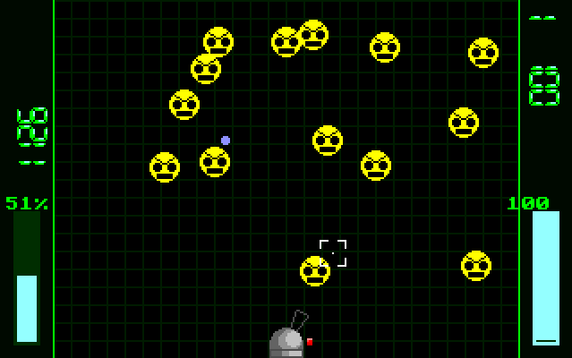
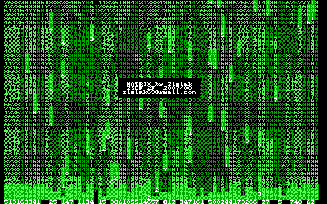
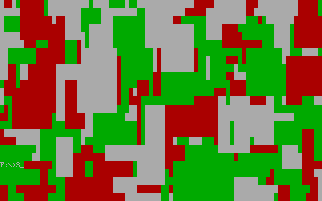

# Turbo Pascal - archive from school exercises

## Notes:

- My code is from about 2007, and some files are external libs from even earlier.
- Some of the programs probably don't work.
- Most of the working examples which come with `.EXE` files require DosBox on modern Windows versions.
- If you want to try modifying code for yourself, look for Turbo Pascal with DOSBox. Make sure to mount this directory as `F:` drive in DOSBox settings. Some programs load images from absolute paths.
- Variables and text are usually written in Polish.

## Highlights:

### `InterwebzDefence\INTERDEF.PAS`

I ignored teacher's instructions and just made a game in 320x200 graphics mode.

To run the exe:

- Ensure DOSBox runs at increased cycles. Don't know the exact value, as I was originally developing it on actual old PC.

To compile yourself:

- `Options -> Compiler Options`, in "Numeric processing" check `8087/80287`.
- `File -> Change dir...` and pick the "InterwebzDefence". Modules are loaded from "current directory" only.

### `Z_MATRIX.PAS`

Number falling down the screen in the Matrix style.

### `KOLORYZA.PAS`

Splashing blobs of 3 colors in rapid succession.

### `SOUND.PAS`

Descending arpeggio of square (?) tune, plays for couple of times.

### `MUSIC.PAS`

Play sine tune with your keyboard!
